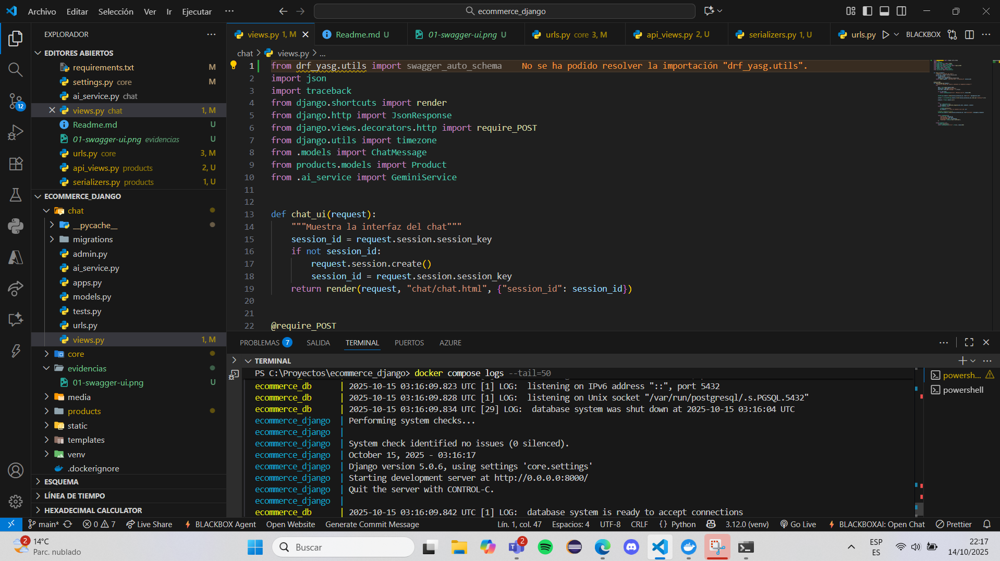
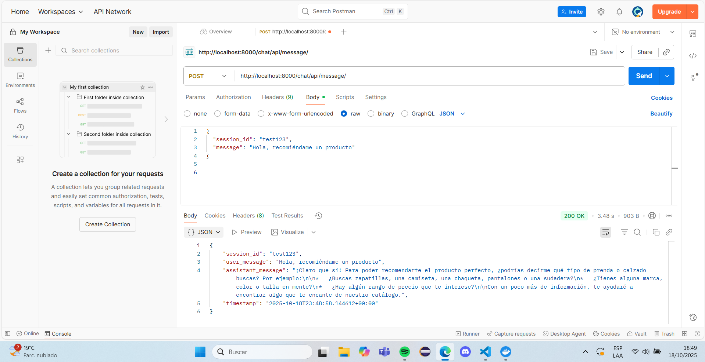
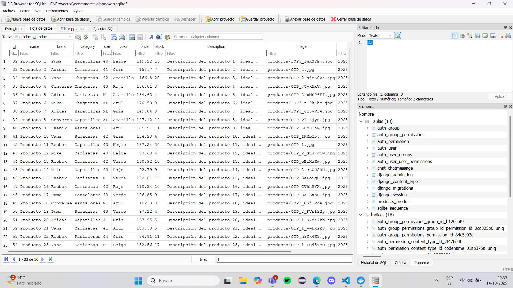

## Ejecución 
```bash
docker compose logs web
docker compose build --no-cache
docker compose up
```


###  Evidencias Requeridas (Screenshots)
#### a) Swagger UI de la API
![swagger] (evidencias/01-swagger-ui.png)

#### b) Logs de Docker


#### c) Docker Desktop o Docker PS
![Docker] (evidencias/03-docker-running.png)

#### d) Llamado a la API desde Postman/Insomnia
![Productos] (evidencias/04-api-call-products.png)

#### e) Llamado al Chat con IA


#### f) Base de Datos con Productos


